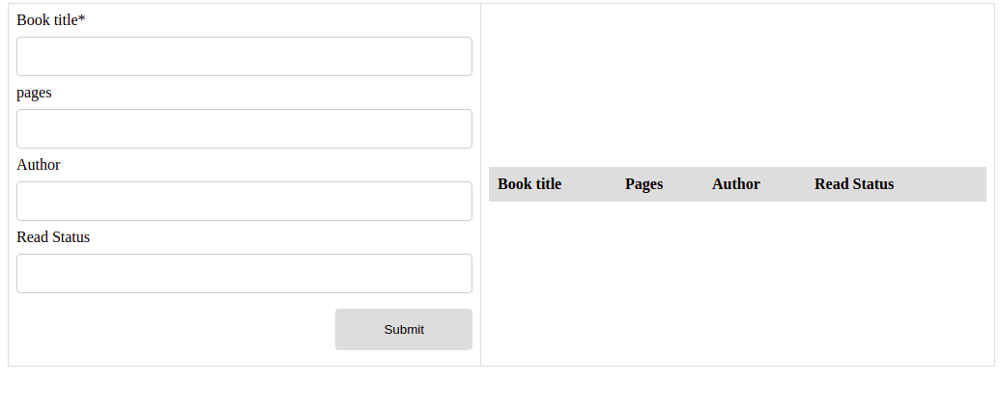

[](https://app.netlify.com/sites/brave-meitner-2e0e54/deploys)

# Library



> The main objective for this application is to express an understanding of CRUD using JS and also DOM manipulation. 


## Built With

- HTML
- CSS
- JavaScript

## Live Demo
[Live Demo](https://brave-meitner-2e0e54.netlify.app/)


### Getting Started
```
Open Terminal
run git clone `git@github.com:KelynPNjeri/Library.git`
Run `index.html`  in your favorite browser.
```


### Deployment

This project has been deployed on Netlify.


## Authors

👤 **Kelyn Paul Njeri**

- Github: [@KelynPNjeri](https://github.com/KelynPNjeri)
- LinkedIn: [KelynNjeri](https://www.linkedin.com/in/kelyn-paul/)


## 🤝 Contributing

Contributions, issues and feature requests are welcome!

## Show your support

Give a ⭐️ if you like this project!

## Acknowledgments

- Microverse
- GitHub
- TheOdinProject
- JavaScript
